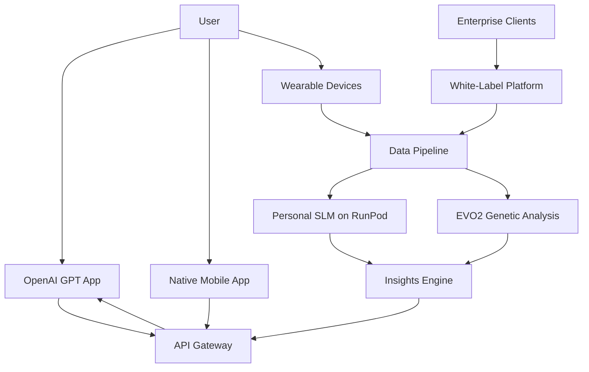

# Personal SLM Platform - Business Model & Monetization Strategy

## Executive Summary

A B2B2C platform that provides hyper-personalized health optimization through private SLMs, combining genetic analysis, real-time biometric data, and AI-powered insights delivered through multiple channels including an OpenAI GPT marketplace app.

## The Moat: Competitive Advantages

### 1. **Data Network Effects**
- **Unique Data Fusion**: Only platform combining EVO2 genetic embeddings + continuous fitness metrics + personalized SLM training
- **Longitudinal Learning**: Each user's model improves over time, creating switching costs
- **Federated Insights**: Aggregate learnings without compromising privacy (differential privacy)

### 2. **Technical Barriers**
- **Complex Integration Stack**: RunPod + Axolotl + EVO2 + secure multi-modal pipeline
- **Privacy-First Architecture**: HIPAA-compliant, user-owned models with encryption
- **Specialized Training**: Health-specific fine-tuning with medical accuracy

### 3. **Regulatory Compliance**
- **HIPAA/GDPR Ready**: Built-in compliance reduces competitor entry
- **Medical Device Pathway**: Potential FDA 510(k) clearance for certain features
- **Genetic Data Handling**: GINA compliance and genetic counselor partnerships

### 4. **Distribution Advantages**
- **OpenAI GPT Store**: Direct access to millions of ChatGPT users
- **Wearable Partnerships**: Native integrations with Garmin, Strava, Whoop
- **Healthcare Channels**: B2B2C through employers, insurers, wellness programs

## Business Model Architecture



## Revenue Streams

### 1. **Direct-to-Consumer (B2C)**

#### Freemium Tiers
- **Free Tier**: Basic insights, 10 queries/month via GPT
- **Pro ($29/month)**: Unlimited queries, real-time sync, basic genetics
- **Elite ($99/month)**: Full genetics, advanced training plans, nutrition optimization
- **Concierge ($299/month)**: Human expert review, custom protocols, family plans

#### One-Time Purchases
- **Genetic Analysis**: $199 (includes EVO2 processing)
- **Performance Assessment**: $99
- **Custom Training Programs**: $49-199

### 2. **Business-to-Business (B2B)**

#### Enterprise Wellness Programs
- **Pricing**: $15-50 per employee per month
- **Features**: Aggregate analytics, ROI reporting, reduced insurance premiums
- **Target**: Companies with 500+ employees
- **TAM**: $8.5B wellness market

#### Healthcare Partnerships
- **Insurers**: Risk reduction programs ($100-500 per member per year)
- **Providers**: Clinical decision support ($1,000-10,000/month per practice)
- **Pharma**: Pharmacogenomics insights for drug development ($1M+ deals)

#### Sports & Performance
- **Pro Teams**: $50,000-500,000 annual contracts
- **NCAA Programs**: $10,000-100,000 per season
- **Olympic Committees**: National partnerships

### 3. **API & Platform Services**

#### Developer Platform
```yaml
pricing_tiers:
  starter:
    price: $99/month
    requests: 10,000
    models: shared

  growth:
    price: $999/month
    requests: 100,000
    models: dedicated
    sla: 99.9%

  enterprise:
    price: custom
    requests: unlimited
    models: custom_training
    compliance: HIPAA_BAA
```

#### Data Marketplace
- **Anonymized Insights**: Sell aggregated, de-identified data to researchers
- **Synthetic Data**: Generate synthetic datasets for AI training ($10K-100K)
- **Clinical Trials**: Recruit participants based on genetic profiles (recruitment fees)

## OpenAI GPT Marketplace Strategy

### The GPT App: "Personal Health Oracle"

```python
# GPT App Configuration
{
  "name": "Personal Health Oracle",
  "description": "Your AI genetics & fitness coach powered by your personal health model",
  "category": "Health & Fitness",

  "capabilities": {
    "secure_data_exchange": "OAuth 2.0 + encrypted tokens",
    "real_time_sync": "WebSocket connection to user's SLM",
    "privacy_mode": "No data stored in OpenAI",
    "verification": "Blue checkmark partner"
  },

  "monetization": {
    "free_tier": "3 insights per day",
    "premium_unlock": "$9.99/month via OpenAI billing",
    "referral_to_app": "30% commission on conversions"
  }
}
```

### User Journey
1. **Discovery**: User finds app in GPT Store
2. **Auth**: Secure OAuth linking to their SLM Vault account
3. **Query**: Ask questions naturally in ChatGPT
4. **Insight**: Receive personalized, genetics-informed answers
5. **Upgrade**: Convert to premium for unlimited access

### Sample Interactions
```
User: "What should I eat before my marathon tomorrow?"

GPT + SLM: "Based on your fast caffeine metabolism (CYP1A2 gene)
and high carb oxidation rate, I recommend:
- 3 hours before: Oatmeal with banana (300 cal)
- 1 hour before: Coffee (your genetics handle it well)
- 30 min before: 1/2 energy gel (your training shows good tolerance)

Your last 3 long runs showed optimal performance with this protocol."
```

## Nutrition Optimization Revenue Model

### 1. **Personalized Meal Planning Service**
- **AI Nutritionist**: $49/month
  - Daily meal plans based on genetics + training
  - Grocery lists with brand recommendations
  - Restaurant menu optimization

### 2. **Supplement Protocol**
- **Precision Supplementation**: $79/month
  - Genetically-optimized supplement stack
  - Partner with suppliers for fulfillment
  - 30-40% margins on products

### 3. **Corporate Cafeteria Optimization**
- **Enterprise Nutrition**: $5,000-50,000/month
  - Optimize menus for employee genetics
  - Reduce healthcare costs
  - Increase productivity metrics

## Technical Architecture for Monetization

### Segregation of Duties
```yaml
components:
  evo2_service:
    deployment: RunPod Serverless
    function: Genetic analysis only
    access: Write-once, read-many
    audit: Complete trail

  personal_slm:
    deployment: RunPod GPU
    function: Inference and training
    isolation: Per-user containers
    billing: Usage-based

  openai_gateway:
    deployment: Edge functions
    function: Secure relay
    data_handling: Zero storage
    compliance: HIPAA proxy

  billing_service:
    deployment: Stripe/AWS
    function: Subscription management
    integration: OpenAI, Apple, Google Pay
```

### API Gateway Pricing Engine
```python
class UsageBasedBilling:
    def calculate_monthly_cost(self, user_metrics):
        base_cost = 10  # Platform fee

        # Compute costs
        training_cost = user_metrics['training_hours'] * 1.50
        inference_cost = user_metrics['queries'] * 0.002
        storage_cost = user_metrics['storage_gb'] * 0.10

        # Premium features
        if user_metrics['genetic_analysis']:
            base_cost += 20
        if user_metrics['real_time_sync']:
            base_cost += 10

        return base_cost + training_cost + inference_cost + storage_cost
```

## Go-to-Market Strategy

### Phase 1: Early Adopters (Q4 2025 - Q1 2026)
- **Target**: Quantified self enthusiasts, biohackers
- **Channel**: Direct, Reddit, podcasts
- **Price**: $99 lifetime early bird
- **Goal**: 1,000 users, product-market fit

### Phase 2: Fitness Market (Q2-Q3 2026)
- **Target**: Serious athletes, marathoners, triathletes
- **Channel**: Strava, Garmin Connect, race partnerships
- **Price**: $29-99/month
- **Goal**: 10,000 users, $200K MRR

### Phase 3: Mainstream Health (Q4 2026 - 2027)
- **Target**: Health-conscious consumers
- **Channel**: OpenAI GPT Store, Apple Health
- **Price**: Freemium with $19/month upgrade
- **Goal**: 100,000 users, $1M MRR

### Phase 4: Enterprise (2027+)
- **Target**: Fortune 500 wellness programs
- **Channel**: Direct sales, benefits consultants
- **Price**: $30/employee/month
- **Goal**: 50 enterprise clients, $5M ARR

## Financial Projections

### Unit Economics
```
Per User Per Month:
- Revenue: $49 (average)
- Costs:
  - RunPod GPU: $3
  - Storage: $1
  - API calls: $2
  - Support: $3
  - CAC amortized: $10
- Gross Margin: 63%
- Contribution Margin: 43%
```

### 3-Year Projection
| Year | Users | ARR | Gross Margin | EBITDA |
|------|-------|-----|--------------|--------|
| 2026 | 10K | $2.4M | 60% | -$1M |
| 2027 | 100K | $24M | 65% | $3M |
| 2028 | 500K | $120M | 70% | $30M |

## Competitive Analysis

### Direct Competitors
1. **InsideTracker**: Blood + DNA, no AI personalization
2. **DNAfit**: Genetics only, no continuous learning
3. **WHOOP Coach**: Fitness only, no genetics
4. **Nutrigenomix**: B2B only, no consumer product

### Our Advantages
- **Only platform with personal SLM**: Continuously learning
- **Multi-modal integration**: Genetics + real-time data
- **Privacy-first**: User owns their model
- **OpenAI distribution**: Massive reach

## Risks & Mitigation

### Regulatory Risk
- **Mitigation**: Partner with telehealth for medical claims
- **Strategy**: Start with wellness, not medical claims

### Competition from Big Tech
- **Mitigation**: Privacy moat, open-source community
- **Strategy**: Partner vs compete (Apple Health integration)

### Data Breach
- **Mitigation**: Zero-knowledge architecture, insurance
- **Strategy**: Security-first marketing

## Exit Strategy

### Potential Acquirers
1. **Fitness**: Peloton ($1.5B), Strava, Garmin
2. **Health Tech**: Teladoc ($8B), Babylon, Ro
3. **Pharma**: Quest Diagnostics, LabCorp
4. **Big Tech**: Apple, Google, Amazon

### Valuation Multiples
- **SaaS Health**: 8-15x ARR
- **AI Platform**: 10-20x ARR
- **Genomics**: 5-10x ARR
- **Target**: $1B+ exit at 100K users

## Key Success Metrics

### North Star Metrics
1. **Weekly Active Users**: Engagement
2. **Model Improvement Rate**: AI effectiveness
3. **Health Outcome Score**: Real impact
4. **Net Revenue Retention**: >120%

### Growth Metrics
- **CAC Payback**: <12 months
- **LTV/CAC**: >3x
- **Monthly Churn**: <5%
- **Viral Coefficient**: >0.5

## Implementation Roadmap

### Q4 2025: Foundation
- [x] Core infrastructure built
- [x] RunPod Axolotl integration
- [ ] Launch OpenAI GPT app
- [ ] Achieve HIPAA compliance

### Q1 2026: Market Entry
- [ ] 1,000 paying users
- [ ] Implement billing system
- [ ] Strava & Garmin integrations

### Q2 2026: Growth
- [ ] 10,000 users
- [ ] Enterprise pilot program
- [ ] Series A fundraising

### Q3 2026: Scale
- [ ] 50,000 users
- [ ] FDA pathway initiation
- [ ] Insurance partnerships

### Q4 2026: Expansion
- [ ] 100,000 users
- [ ] International launch
- [ ] B2B platform launch

## Conclusion

The combination of personal SLMs, genetic analysis, and continuous biometric learning creates a defensible moat in the $50B+ digital health market. The OpenAI GPT Store provides unprecedented distribution, while the privacy-first architecture appeals to premium customers willing to pay for personalized health optimization.