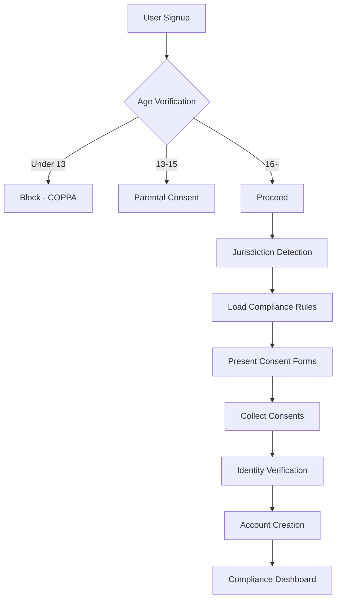

# Compliance & Regulatory Framework

## Executive Summary

Comprehensive compliance framework for personal health SLM platform operating at the intersection of genetic testing, health data processing, and AI-powered health recommendations.

## Regulatory Landscape

### 1. Healthcare Regulations

#### HIPAA (United States)
```yaml
status: REQUIRED
applies_to: All US users and healthcare partnerships
requirements:
  - Physical safeguards: Encrypted storage, access controls
  - Administrative: BAAs with all vendors, training programs
  - Technical: Audit logs, encryption, integrity controls

implementation:
  encryption:
    at_rest: AES-256-GCM
    in_transit: TLS 1.3
    key_management: HSM/KMS with rotation

  access_control:
    authentication: Multi-factor required
    authorization: Role-based (RBAC)
    audit: Complete access logs for 7 years

  business_associates:
    runpod: BAA required
    stripe: BAA for payment processing
    openai: Data processing agreement

penalties: Up to $2M per violation
```

#### GDPR (European Union)
```yaml
status: REQUIRED for EU users
requirements:
  - Lawful basis: Explicit consent
  - Data minimization: Collect only necessary data
  - Right to erasure: Complete deletion within 30 days
  - Data portability: Export in machine-readable format
  - Privacy by design: Built-in protection

implementation:
  consent_management:
    - Granular consent for each data type
    - Withdrawal mechanism
    - Age verification (16+ or parental consent)

  data_rights:
    - Automated export API
    - Deletion pipeline with verification
    - Data correction interface

penalties: Up to 4% of global revenue or €20M
```

### 2. Genetic Data Regulations

#### GINA (Genetic Information Nondiscrimination Act)
```yaml
jurisdiction: United States
prohibits: Discrimination in health insurance and employment
our_responsibilities:
  - Never share genetic data with insurers
  - Explicit consent for any employer programs
  - Clear disclosure of data usage

compliance_measures:
  - Segregated genetic data storage
  - Separate consent flows
  - Audit trail for all genetic data access
```

#### State-Specific Genetic Privacy Laws
```yaml
california_sb_41:
  - Direct-to-consumer genetic testing regulations
  - Requires informed consent
  - Data destruction requirements

new_york_biometric_law:
  - Genetic data as biometric identifier
  - Written consent required
  - Private right of action

implementation:
  - State detection via IP/billing address
  - State-specific consent forms
  - Compliance dashboard per jurisdiction
```

### 3. Medical Device Regulations

#### FDA Considerations
```yaml
classification_analysis:
  current_status: General Wellness Device
  rationale: |
    - Makes only general wellness claims
    - Low risk to users
    - No specific disease claims

  future_pathway: 510(k) if making medical claims
  requirements_if_medical:
    - Clinical validation studies
    - Quality management system (QMS)
    - Adverse event reporting
    - Post-market surveillance

strategy:
  phase_1: Launch as wellness device
  phase_2: Collect real-world evidence
  phase_3: FDA consultation for medical claims
  phase_4: 510(k) submission if applicable
```

#### CE Marking (Europe)
```yaml
classification: Not currently medical device
future_considerations:
  - MDR compliance if medical claims
  - Clinical evaluation requirements
  - Notified body involvement
```

### 4. AI/ML Specific Regulations

#### EU AI Act
```yaml
risk_level: High-risk (health-related AI)
requirements:
  - Transparency: Explain AI decisions
  - Human oversight: Allow manual review
  - Data governance: Quality requirements
  - Accuracy: Performance metrics
  - Cybersecurity: Robust protection

implementation:
  - Explainable AI modules
  - Human-in-the-loop options
  - Model cards for transparency
  - Regular audits and testing
```

#### Algorithmic Accountability
```yaml
jurisdictions: [NYC, California proposed]
requirements:
  - Bias audits
  - Transparency reports
  - Impact assessments

our_approach:
  - Annual fairness audits
  - Demographic parity monitoring
  - Public transparency reports
```

## Compliance Architecture

### Technical Implementation

```python
class ComplianceManager:
    """Central compliance management system"""

    def __init__(self):
        self.consent_store = ConsentManagement()
        self.audit_logger = AuditLogger()
        self.data_governor = DataGovernance()

    async def verify_consent(self, user_id: str, data_type: str) -> bool:
        """Verify user consent for specific data usage"""
        consent = await self.consent_store.get_consent(user_id, data_type)

        if not consent or consent.expired:
            raise ComplianceException("Valid consent required")

        await self.audit_logger.log_consent_check(user_id, data_type)
        return True

    async def handle_deletion_request(self, user_id: str) -> Dict:
        """GDPR-compliant data deletion"""
        # Verify identity
        if not await self.verify_user_identity(user_id):
            raise SecurityException("Identity verification failed")

        # Execute deletion
        deletion_report = {
            "user_id": user_id,
            "timestamp": datetime.now().isoformat(),
            "deleted_items": []
        }

        # Delete from all systems
        for system in ["slm_models", "genetic_data", "fitness_data", "analytics"]:
            result = await self.delete_from_system(user_id, system)
            deletion_report["deleted_items"].extend(result)

        # Log for compliance
        await self.audit_logger.log_deletion(deletion_report)

        # Send confirmation
        await self.send_deletion_confirmation(user_id, deletion_report)

        return deletion_report

    async def export_user_data(self, user_id: str) -> str:
        """GDPR Article 20 - Data Portability"""
        # Collect all user data
        data = {
            "profile": await self.get_user_profile(user_id),
            "genetic_data": await self.get_genetic_data(user_id),
            "fitness_history": await self.get_fitness_data(user_id),
            "model_outputs": await self.get_model_history(user_id),
            "consent_history": await self.consent_store.get_history(user_id)
        }

        # Create encrypted archive
        archive_path = await self.create_encrypted_archive(data, user_id)

        # Log export
        await self.audit_logger.log_export(user_id, archive_path)

        return archive_path
```

### Consent Management

```yaml
consent_types:
  essential:
    - description: Core service functionality
    - optional: false
    - duration: Account lifetime

  genetic_processing:
    - description: Process genetic data for insights
    - optional: true
    - duration: 2 years renewable
    - withdrawal: Immediate effect

  fitness_tracking:
    - description: Continuous fitness data collection
    - optional: true
    - duration: 1 year renewable
    - withdrawal: Stops collection, retains history

  research_participation:
    - description: Anonymous data for research
    - optional: true
    - duration: 5 years
    - withdrawal: Future data only

  marketing_communications:
    - description: Product updates and offers
    - optional: true
    - duration: Until withdrawn
    - withdrawal: Immediate
```

### Data Governance

```yaml
data_classification:
  critical:
    - genetic_sequences
    - health_conditions
    - treatment_history
    retention: 10 years or user deletion
    encryption: Required
    access: Restricted + MFA

  sensitive:
    - fitness_metrics
    - nutrition_data
    - sleep_patterns
    retention: 3 years
    encryption: Required
    access: User + authorized systems

  internal:
    - usage_analytics
    - performance_metrics
    - system_logs
    retention: 1 year
    encryption: Recommended
    access: Internal teams

  public:
    - marketing_content
    - documentation
    retention: Indefinite
    encryption: Optional
    access: Unrestricted
```

## Compliance Processes

### 1. Onboarding Compliance



### 2. Ongoing Compliance

#### Daily Operations
- Automated consent expiry checks
- Access log reviews
- Anomaly detection
- Compliance metrics dashboard

#### Weekly Reviews
- Deletion request processing
- Export request fulfillment
- Consent renewal reminders
- Audit log analysis

#### Monthly Assessments
- Compliance scorecard
- Regulatory update review
- Training compliance
- Vendor compliance checks

#### Quarterly Audits
- Full compliance audit
- Penetration testing
- Policy updates
- Board reporting

### 3. Incident Response

```yaml
breach_response_plan:
  detection:
    - Automated alerts
    - 24/7 monitoring
    - User reports

  containment:
    - Isolate affected systems
    - Prevent further access
    - Preserve evidence

  assessment:
    - Determine scope
    - Identify affected users
    - Document timeline

  notification:
    - Users: Within 72 hours (GDPR)
    - Regulators: As required
    - Partners: Per agreements
    - Public: If required

  remediation:
    - Fix vulnerabilities
    - Enhance controls
    - Update policies

  review:
    - Post-incident analysis
    - Lessons learned
    - Control improvements
```

## Documentation Requirements

### Required Documents

1. **Privacy Policy**
   - Data collection practices
   - Usage and sharing
   - User rights
   - Contact information

2. **Terms of Service**
   - Service description
   - User obligations
   - Liability limitations
   - Dispute resolution

3. **Data Processing Agreements**
   - With all processors
   - GDPR Article 28 compliant
   - Security requirements
   - Audit rights

4. **Consent Records**
   - Timestamp
   - Version
   - Specific permissions
   - Withdrawal method

5. **Audit Logs**
   - Access logs (7 years)
   - Modification logs
   - Deletion logs
   - Export logs

## Compliance Monitoring

### KPIs and Metrics

```yaml
metrics:
  consent_rate:
    target: >95%
    measurement: Daily

  deletion_request_time:
    target: <30 days
    measurement: Per request

  export_request_time:
    target: <7 days
    measurement: Per request

  audit_completeness:
    target: 100%
    measurement: Monthly

  training_completion:
    target: 100%
    measurement: Quarterly

  vendor_compliance:
    target: 100%
    measurement: Annual

  breach_notification_time:
    target: <72 hours
    measurement: Per incident
```

### Compliance Dashboard

```python
class ComplianceDashboard:
    """Real-time compliance monitoring"""

    def get_compliance_score(self) -> Dict:
        return {
            "overall_score": 94,
            "hipaa_compliance": 96,
            "gdpr_compliance": 92,
            "consent_coverage": 98,
            "audit_completeness": 100,
            "training_status": 89,
            "last_audit": "2024-01-10",
            "next_audit": "2024-04-10",
            "open_issues": 3,
            "critical_issues": 0
        }

    def get_risk_assessment(self) -> Dict:
        return {
            "high_risk_areas": [
                "Third-party integrations",
                "Cross-border data transfers"
            ],
            "medium_risk_areas": [
                "Consent renewal rates",
                "Vendor compliance"
            ],
            "low_risk_areas": [
                "Data encryption",
                "Access controls"
            ],
            "recommendations": [
                "Enhance third-party vetting",
                "Implement consent automation",
                "Increase security training frequency"
            ]
        }
```

## Training Program

### Required Training

1. **All Employees**
   - Privacy fundamentals (Annual)
   - Security awareness (Quarterly)
   - Incident response (Annual)

2. **Engineering Team**
   - Secure coding (Bi-annual)
   - HIPAA technical (Annual)
   - Privacy by design (Onboarding)

3. **Customer Support**
   - Data handling (Quarterly)
   - Consent management (Bi-annual)
   - User rights (Quarterly)

4. **Management**
   - Compliance overview (Annual)
   - Risk management (Bi-annual)
   - Breach response (Annual)

## Vendor Management

### Vendor Requirements

```yaml
required_assessments:
  security_questionnaire: Required
  soc2_type2: Preferred
  iso27001: Preferred
  hipaa_baa: Required if PHI
  gdpr_dpa: Required if EU data
  penetration_test: Annual
  insurance: $5M minimum
```

### Key Vendor Agreements

1. **RunPod** (Infrastructure)
   - BAA in place
   - DPA signed
   - Annual audit rights

2. **Stripe** (Payments)
   - PCI DSS compliance
   - BAA for subscription data
   - No health data access

3. **OpenAI** (GPT Integration)
   - Data processing agreement
   - No data retention
   - API-only access

## Budget & Resources

### Compliance Budget (Annual)

| Category | Budget | Notes |
|----------|--------|-------|
| Legal Counsel | $100,000 | Privacy & healthcare law |
| Audits & Assessments | $75,000 | SOC2, penetration testing |
| Compliance Software | $50,000 | GRC platform, monitoring |
| Training | $25,000 | Programs and certifications |
| Insurance | $150,000 | Cyber, E&O, General liability |
| Consultants | $50,000 | Specialized expertise |
| **Total** | **$450,000** | ~5% of revenue at $10M ARR |

## Roadmap

### Year 1: Foundation
- [x] HIPAA compliance
- [x] GDPR compliance
- [ ] SOC2 Type 1
- [ ] Consent automation

### Year 2: Maturation
- [ ] SOC2 Type 2
- [ ] ISO 27001
- [ ] FDA consultation
- [ ] State licensure

### Year 3: Excellence
- [ ] FDA clearance (if applicable)
- [ ] CE marking
- [ ] HITRUST certification
- [ ] Global expansion compliance

## Conclusion

This comprehensive compliance framework positions the platform for sustainable growth while maintaining the highest standards of data protection and regulatory compliance. Regular reviews and updates ensure continued alignment with evolving regulations.