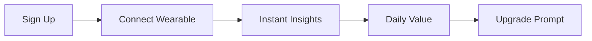
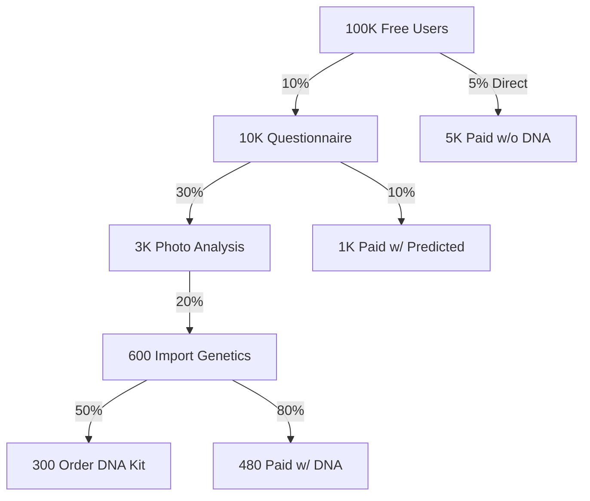

# Progressive Onboarding Strategy - Zero to DNA

## The Problem with DNA-First

Current barriers to adoption:
- **Cost**: $99-499 for genetic testing
- **Time**: 2-6 weeks wait for results
- **Trust**: Giving DNA to unknown company
- **Complexity**: Understanding genetic data
- **Commitment**: High upfront investment before seeing value

## Progressive Value Delivery Model

### Level 0: Instant Start (Day 1)
**Zero Barrier Entry - Just Connect Existing Data**



**Data Sources:**
- Apple Health / Google Fit (already on phone)
- Strava / Garmin (for athletes)
- MyFitnessPal (nutrition)
- Sleep apps

**Immediate Value:**
- Sleep optimization tips
- Recovery recommendations
- Training load analysis
- Nutrition timing

**Hook:** "Your AI coach starts learning immediately"

### Level 1: Family History Questionnaire (Day 2-7)
**Pseudo-Genetic Insights Without DNA**

```python
class FamilyHistoryPredictor:
    """Predict genetic risks from family history"""

    def estimate_genetic_risks(self, family_data):
        risks = {}

        # Cardiovascular risk
        if family_data['heart_disease_count'] > 2:
            risks['cardiovascular'] = 0.7

        # Diabetes risk
        if family_data['diabetes_type2_count'] > 1:
            risks['diabetes'] = 0.6

        # Athletic predisposition
        if family_data['athletic_family_members'] > 2:
            risks['power_athlete'] = 0.65

        return risks
```

**Smart Questionnaire Design:**

1. **Conversational Flow** (not medical forms)
   - "Does anyone in your family run marathons?"
   - "Do you have relatives with diabetes?"
   - "What's your ethnic background?" (population genetics)

2. **Gamified Progress**
   - Each answer unlocks new insights
   - Progress bar showing "AI Learning: 45%"
   - Immediate feedback after each question

3. **Predictive Power**
   - Use population genetics databases
   - Bayesian inference from family patterns
   - Ethnicity-based allele frequencies

**Example Questions:**

```yaml
family_athletics:
  question: "Athletic ability often runs in families. Do you have any relatives who:"
  options:
    - Professional/college athletes
    - Marathon runners or triathletes
    - Natural strength (construction, farming)
    - Quick reflexes (martial arts, gaming)
  insight: "Based on your family, you likely have [X]% fast-twitch muscle fibers"

health_conditions:
  question: "Understanding family health helps personalize recommendations:"
  conditions:
    - High blood pressure
    - Diabetes
    - Heart disease
    - Obesity
    - Alzheimer's
  insight: "Your family history suggests focusing on [specific prevention strategies]"

longevity:
  question: "How long do people in your family typically live?"
  options:
    - Many 90+ years
    - Mostly 80-90
    - Mostly 70-80
    - Under 70
  insight: "Your family longevity suggests [specific health optimizations]"
```

### Level 2: Lifestyle Genetics (Week 2-4)
**Infer Genetics from Behavior**

```python
class BehavioralGeneticsInference:
    """Infer genetic traits from observable behaviors"""

    def infer_caffeine_metabolism(self, user_data):
        # Fast metabolizers can drink coffee late
        if user_data['coffee_after_3pm'] and user_data['sleep_quality'] > 0.7:
            return "likely_fast"
        elif user_data['coffee_sensitivity']:
            return "likely_slow"

    def infer_lactose_tolerance(self, user_data):
        # Lactose intolerance causes digestive issues
        if user_data['dairy_discomfort']:
            return "likely_intolerant"
        return "likely_tolerant"

    def infer_muscle_composition(self, user_data):
        # Sprint vs endurance preference indicates fiber type
        if user_data['prefers_sprints'] and user_data['builds_muscle_easily']:
            return "fast_twitch_dominant"
        elif user_data['prefers_long_runs'] and user_data['slow_muscle_gain']:
            return "slow_twitch_dominant"
```

**Observable Genetic Markers:**
- Caffeine sensitivity (CYP1A2)
- Alcohol flush (ALDH2)
- Lactose tolerance (LCT)
- Cilantro taste (OR6A2)
- Muscle growth rate (ACTN3)
- Sun sensitivity (MC1R)

### Level 3: Physical Trait Analysis (Month 2)
**Photo-Based Genetic Inference**

```python
class VisualGeneticAnalysis:
    """Infer genetic traits from photos (with consent)"""

    def analyze_physical_traits(self, photo):
        traits = {}

        # Body composition genetics
        traits['body_type'] = self.classify_somatotype(photo)
        # Ectomorph -> likely certain genetic variants

        # Skin/hair/eye color (MC1R, OCA2, etc.)
        traits['melanin'] = self.estimate_melanin_genes(photo)

        # Facial structure (ancestry inference)
        traits['ancestry'] = self.infer_ancestry_markers(photo)

        return traits
```

**Privacy-First Implementation:**
- On-device processing only
- No photos stored
- Only extracted features saved
- Clear consent and value prop

### Level 4: Consumer Genetics Integration (Month 3+)
**Import Existing Data**

Support imports from:
- 23andMe
- AncestryDNA
- MyHeritage
- Nebula Genomics
- Raw VCF/FASTA files

**Smart Import Flow:**
```javascript
const importFlow = {
  detect: async (file) => {
    // Auto-detect format
    if (file.includes('rsid')) return '23andMe';
    if (file.includes('AncestryDNA')) return 'Ancestry';
    return 'generic_vcf';
  },

  process: async (file, format) => {
    // Extract relevant SNPs only
    const healthSNPs = extractHealthMarkers(file);
    const fitnessSNPs = extractFitnessMarkers(file);

    // Don't store raw file
    return {
      markers: [...healthSNPs, ...fitnessSNPs],
      coverage: calculateCoverage()
    };
  }
};
```

### Level 5: Clinical-Grade Sequencing (Month 6+)
**Premium Offering**

Partner with clinical labs for:
- Whole genome sequencing
- Pharmacogenomics panel
- Carrier screening
- Methylation analysis

**Value Proposition:**
"Now that your AI knows you, unlock its full potential with clinical-grade genetics"

## Progressive Value Hooks

### Week 1: Behavioral Insights
```
"Based on your sleep pattern, you likely have a delayed chronotype.
Try these 3 adjustments..."
```

### Week 2: Family Risk Insights
```
"Your family history suggests higher cardiovascular risk.
Your HRV pattern confirms you should prioritize..."
```

### Week 4: Inferred Genetics
```
"Your recovery patterns suggest you're likely a fast COMT metabolizer.
This means you handle stress well but need more..."
```

### Month 2: Comparative Insights
```
"Users with similar patterns who added genetic data discovered
3 surprising optimizations. Unlock with DNA kit..."
```

## Conversion Funnel



## Technical Implementation

### Progressive Model Training

```python
class ProgressivePersonalSLM:
    def __init__(self, user_id):
        self.user_id = user_id
        self.confidence_levels = {
            'behavioral': 0.6,
            'family_history': 0.7,
            'inferred_genetics': 0.75,
            'imported_genetics': 0.9,
            'clinical_genetics': 0.95
        }

    def update_model(self, new_data_type, data):
        """Progressive model improvement"""

        if new_data_type == 'questionnaire':
            # Add probabilistic genetic layer
            self.add_predicted_genetics(data)

        elif new_data_type == 'behavioral':
            # Refine predictions from behavior
            self.refine_genetic_predictions(data)

        elif new_data_type == 'genetic':
            # Replace predictions with real data
            self.replace_predictions_with_reality(data)

        # Retrain with new confidence weights
        self.retrain_with_confidence()
```

### Confidence-Weighted Recommendations

```python
def generate_recommendation(user_data, confidence):
    if confidence < 0.7:
        # Conservative recommendations
        return "Based on your patterns, consider trying..."

    elif confidence < 0.9:
        # Moderate confidence
        return "Your likely genetics suggest..."

    else:
        # High confidence
        return "Your genetic profile indicates..."
```

## Marketing Messages by Stage

### Stage 0: No DNA Required
> "Start optimizing your health in 60 seconds. No DNA kit needed."

### Stage 1: Family Patterns
> "Your family history unlocks powerful health insights."

### Stage 2: Behavioral Genetics
> "Your habits reveal your genetics. AI fills in the gaps."

### Stage 3: Visual Analysis
> "Your physical traits tell a genetic story."

### Stage 4: Import Existing
> "Already have DNA results? Import them instantly."

### Stage 5: Clinical Upgrade
> "Ready for clinical-grade insights? Unlock your full potential."

## Retention Through Progressive Value

1. **Daily Wins**: Immediate value from fitness data
2. **Weekly Discoveries**: New insights from patterns
3. **Monthly Upgrades**: Unlock new capabilities
4. **Quarterly Assessments**: Show improvement
5. **Annual Deep Dive**: Complete health transformation

## Competitive Advantages

1. **Lowest Barrier to Entry**: Start free, no DNA required
2. **Immediate Value**: Insights on day 1
3. **Progressive Commitment**: Build trust before DNA
4. **Unique Approach**: Only platform that works without genetics
5. **Network Effects**: More users = better predictions

## Success Metrics

### Activation Funnel
- Sign-up → Connect wearable: 60%
- Connect → First insight: 90%
- First insight → Day 7 retention: 40%
- Day 7 → Complete questionnaire: 25%
- Questionnaire → Paid conversion: 10%
- Any stage → DNA upgrade: 5-10%

### Revenue Impact
- Without DNA requirement: 10x larger addressable market
- Faster viral growth: Lower barrier to share
- Higher LTV: Gradual value delivery builds habit
- Lower CAC: No need to overcome DNA hesitation

## Conclusion

By removing DNA as a barrier to entry and progressively building value, we can:
1. Acquire users 10x cheaper
2. Demonstrate value before asking for commitment
3. Build trust gradually
4. Create multiple monetization points
5. Still capture high-value DNA customers

The key insight: **Make genetics the premium upgrade, not the entry requirement.**